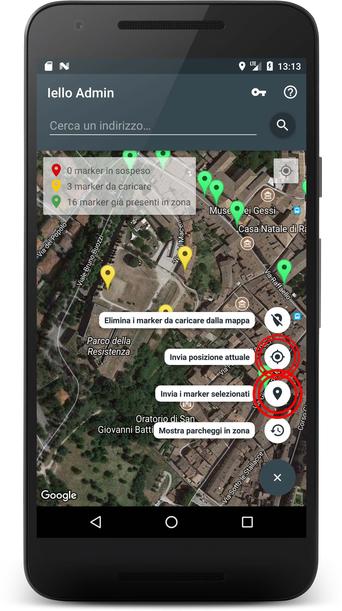

# Iello Admin App #
Questa repository contiene il codice dell'app Android per amministratori di [Project Iello](https://prezi.com/p/bkqagzs4v_w5/). L'applicazione è stata pensata per gestire il database remoto, inserendo e modificando i dati relativi ai posteggi per disabili, tramite [l'API da noi realizzata](https://github.com/IelloDevTeam/IelloAPI "Iello API Repo"). 

A differenza dell'[app Android Iello per gli utenti](https://github.com/IelloDevTeam/IelloAndroidApp), questa è stata pensata per essere utilizzata solo dagli sviluppatori o agli addetti alla ricerca dei posteggi, per garantire l'affidabilità dei dati. Per tali ragioni tale app nono verrà pubblicata nel Play Store.

## Indice contenuti ##
* [Integrazione con IelloAPI](#integrazione-con-ielloapi)
* [Funzionalità dell'applicazione](#funzionalità-dellapplicazione)
  * [Autenticazione](#autenticazione)
  * [Visualizzazione dei parcheggi già presenti](#visualizzazione-dei-parcheggi-già-presenti)
  * [Inserimento di una nuova posizione](#inserimento-di-una-nuova-posizione)
  * [Eliminazione di una posizione presente](#eliminazione-di-una-posizione-presente)
  * [Altre funzioni](#altre-funzioni)
* [Librerie aggiuntive utilizzate](#librerie-aggiuntive-utilizzate)
* [Licenza](#licenza)
* [Contatti & Credits](#contatti--credits)

## Integrazione con IelloAPI ##
L'applicazione utilizza le funzionalità offerte da [Iello API](https://github.com/IelloDevTeam/IelloAPI "Iello API Repo") per inviare nuove posizioni, visualizzare quelle già presenti nel database e eliminare quelle indesiderate.

## Funzionalità dell'applicazione ##

### Autenticazione ###
Al primo avvio dell'app, viene mostrata una finestra Dialog, che richede all'utente la chiave dell'API (*API key*). Questa altro non è che **una password conosciuta solo dagli amministratori, che permette di modificare le entry del database tramite le funzioni di IelloAPI**. L'API fornisce infatti delle particolari funzioni che permettono di aggiungere o eliminare parcheggi dal database in modo sicuro. Eventuali utenti malintenzionati non possono modificare il database senza la conoscenza di tale password.   

### Visualizzazione dei parcheggi già presenti ###
La schermata di base dell'applicazione mostra una mappa (di default impostata sopra a Urbino) con dei **marker di colore verde**. Questi rappresentano la posizione dei parcheggi già presenti nel database, entro un raggio di 500 metri rispetto alla posizione centrale della mappa.

I marker di colore verde vengono visualizzati anche in assenza dell'API key, essendo la funzione di ricerca dell'API open source. Quindi, gli utenti dell'applicazione possono spostare la mappa, inserendo un indirizzo o tramite il GPS del proprio smartphone, e visualizzare i parcheggi attorno a tali posizioni.

È possibile inoltre effettuare un **refresh manuale per mostrare i parcheggi presenti**, che permette di mostrare i parcheggi attorno alla posizione centrale della mappa, premendo l'apposita voce del tasto FAB.   

### Inserimento di una nuova posizione ###

La funzionalità principale dell'applicazione è l'inserimento di nuovi dati all'interno del database. Premendo un punto nella mappa, viene impostato un **marker "provvisorio" di colore rosso**. È necessario premere nuovamente il marker per inserirlo nella **coda di inserimento**. I marker nella coda, distinguibili in quanto di colore giallo, possono essere inseriti nel database, tramite l'apposita voce all'interno del tasto FAB. La coda di inserimento, in quanto tale, può contenere anche più marker contemporaneamente.

È anche possibile inviare direttamente al database la propria posizione, individuata tramite il GPS del proprio smartphone. Tale funzione è però molto imprecisa e va evitato il suo utilizzo quando possibile.

L'inserimento avviene tramite l'apposita funzione dell'API. Se non si dispone dell'API key, o nel caso in cui quella inserita fosse errata, viene mostrato un messaggio di errore dopo il tentativo di inserimento.   

### Eliminazione di una posizione presente ###
Tramite l'applicazione è anche possibile eliminare dal database delle posizioni inserite precedentemente. Per far ciò, è sufficiente selezionare uno dei marker verdi presenti nella mappa. Verrà aperto un apposito Dialog per confermare l'eliminazione, quindi in caso di consenso, il marker viene eliminato. 

Ancora una volta, l'eliminazione avviene tramite una funzione dell'API: senza l'API key corretta, non viene effettuata la modifica.    

### Altre funzioni ###
* Nell'applicazione, per agevolarne l'utilizzo, è stata inserita una legenda con i colori dei marker e i rispettivi significati;
* In altro a destra dello schermo, è stata posta una icona che rimanda alle istruzioni di base per l'utilizzo dell'app;
* Mentre si utilizza l'applicazione, viene disattivato il timeout dello schermo; tramite l'utilizzo dell'app ci si è infatti resi conto che tale funzione rende più agevole l'utilizzo dell'app nel concreto.

## Librerie aggiuntive utilizzate ##
* **[Android Support Design Libraries](https://developer.android.com/topic/libraries/support-library/index.html)**:
  utilizzato per la creazione delle interfacce secondo le [linee guida di design Google](https://material.io/guidelines/);
* **[Google Maps API](https://developers.google.com/maps/documentation/android-api/)**:
  utilizzato per sfruttare le mappe Google e le relative funzioni, geocoding e reverse geocoding;
* **[Volley](https://github.com/google/volley)**: API sviluppata da Google per effettuare Web request in modo più facile, veloce e sicuro;
* **[Firebase Core, Authentication e Database Services](https://firebase.google.com/docs/reference/android/packages)**:  utilizzato per integrare funzionalità di controllo Firebase nell'app, e l'interazione con il database remoto;
* **[MaterialSearchView by Miguel Catalan](https://github.com/MiguelCatalan/MaterialSearchView)**: utilizzata per la barra di ricerca.

## Licenza ##
MIT License

Copyright (c) 2017 IelloDevTeam

Permission is hereby granted, free of charge, to any person obtaining a copy
of this software and associated documentation files (the "Software"), to deal
in the Software without restriction, including without limitation the rights
to use, copy, modify, merge, publish, distribute, sublicense, and/or sell
copies of the Software, and to permit persons to whom the Software is
furnished to do so, subject to the following conditions:

The above copyright notice and this permission notice shall be included in all
copies or substantial portions of the Software.

THE SOFTWARE IS PROVIDED "AS IS", WITHOUT WARRANTY OF ANY KIND, EXPRESS OR
IMPLIED, INCLUDING BUT NOT LIMITED TO THE WARRANTIES OF MERCHANTABILITY,
FITNESS FOR A PARTICULAR PURPOSE AND NONINFRINGEMENT. IN NO EVENT SHALL THE
AUTHORS OR COPYRIGHT HOLDERS BE LIABLE FOR ANY CLAIM, DAMAGES OR OTHER
LIABILITY, WHETHER IN AN ACTION OF CONTRACT, TORT OR OTHERWISE, ARISING FROM,
OUT OF OR IN CONNECTION WITH THE SOFTWARE OR THE USE OR OTHER DEALINGS IN THE
SOFTWARE.

## Contatti & Credits ##
App realizzata come parte di un progetto di esame (PDGT) da [Riccardo Maldini](https://github.com/maldins46), [Andrea Petreti](https://github.com/petretiandrea), [Alessia Ventani](https://github.com/AlessiaVe) e [Elia Trufelli](https://github.com/EliaT95).
